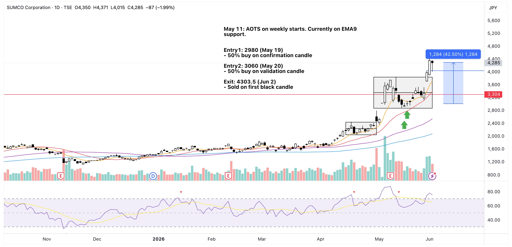
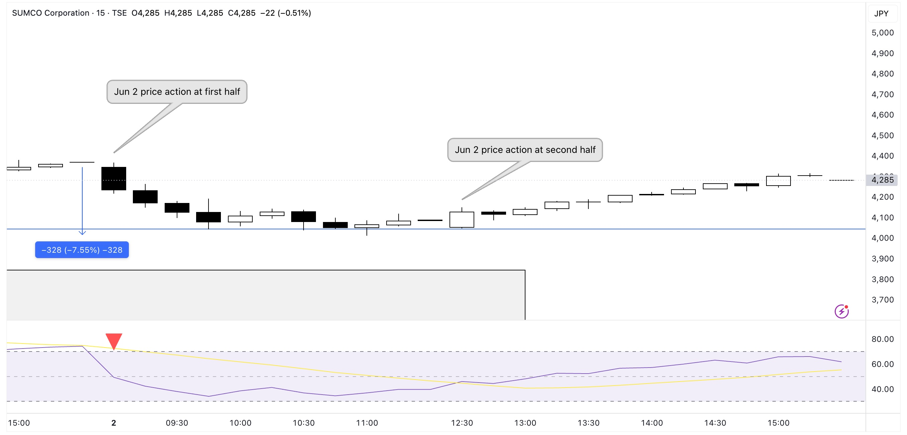

My biggest JP market win to date! From an average entry price of 3020 to a 4303 exit, that's about a 43% gain.

To be honest I feel like I'm finding my niche with swing trading. I know it's a bull market and I still need to prove myself when things go upside down, but wins like this helps you be more confident in executing your trade ideas. 

## Trade Plan
May 11: AOTS on weekly starts. Currently on EMA9 support.

Entry1: 2980 (May 19)
- 50% buy on day-1 (confirmation) candle

Entry2: 3060 (May 20)
- 50% buy on day-2 (validation) candle

Target price: ~3750 level for a ~23% gain
CL: 7% to MA20 trend line
RRR: 3:1

## Notes

May 22: RSI is healthy (60 as of yesterday EOD).

May 28: Daily MA20 seems to be holding.

May 29: Box BO with strong volume

Jun 1: BO confirmation with strong volume.

## Exit
Jun 2: Sold EOD at first black candle.

Price was in the lower level of -7% to -5% in the first half of the trading day then started to climb back up in second half. So far price movement in the JP market tends to be better towards the EOD.

{==So far price movement in the JP market tends to be better towards the EOD.==}

{==Also, the JP market seems to have a warm-up period in the first 30 mins of the day. Avoid trading during this time.==}