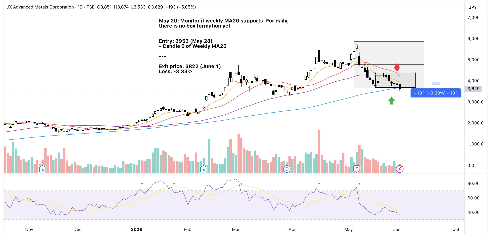
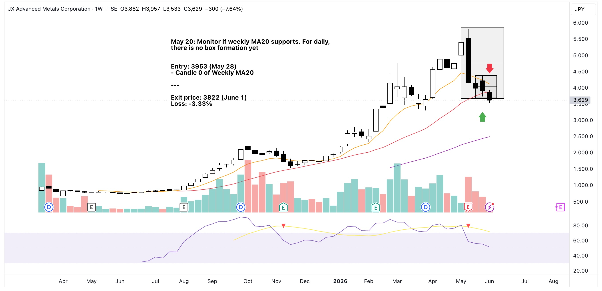

Last May 20 I noticed a big pull back with a potential weekly MA20 support. I bet on candle-0 of that MA support line hoping for a good price action the following week.

Monday came and the reality looked to be going the opposite way.

Price action was too slow. Then I realized I never looked at the RSI level before entering.

This was also my first time buying below MA50.

Concluded capital is better elsewhere.

Create case study for later but this looks to be a successful exit after today's daily MA100 breakdown.

{==Check the daily RSI even when betting on weekly!==}