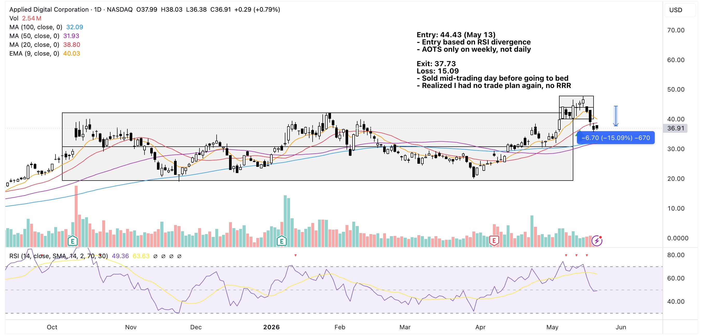

This one hurt and hit differently because it was the first trade I executed with my new broker.

There's nothing much to say here since there weren't clear buy signals to begin with.

Another loss to be charged to experience!

{==Always have a trade plan! ==}