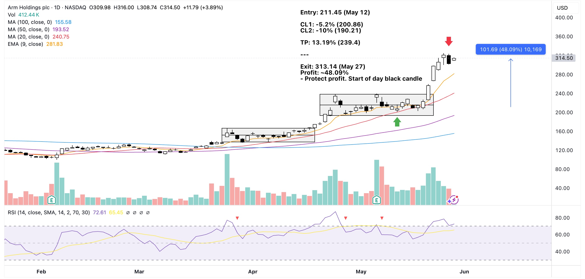

## Trade Plan (May 12)
- Entry price: 211.45
- CL1: -5.2% (200.86 at MA20 support)
- CL2: -10% (190.21 at box bottom)
- TP on box top: 13.19% (239.4)
- Check daily MA20 support
- Check 4H MA50 support

## Notes
**May 21**

- At EOD: strong box breakout overtaking the initial TP. Also with good volume. Decided not sell for now.
- Monitor price movement the following day.

**May 22**

- Early trading hours shows strong demand, though it's end of week so watch out for price action more carefully.
- Gap up opening.
- Missed to check daily MA20 and 4H MA50 previously. But as of today both supports were followed.
- Box breakout occurred after hitting support level 
- At EOD: Long white candle with almost no wick. Decided not to take profit for now. Monitor again tomorrow.
- RSI looks good.

**May 26**

- First trading of the week.
- Holding. RSI looks healthy.

## Thoughts on Exit
**Actual exit price: 313.14 (May 27)**

- Noticed price action in smaller intervals was not holding well. (Black candle in morning hours).
- Secured profit. Watch out for a re-entry.