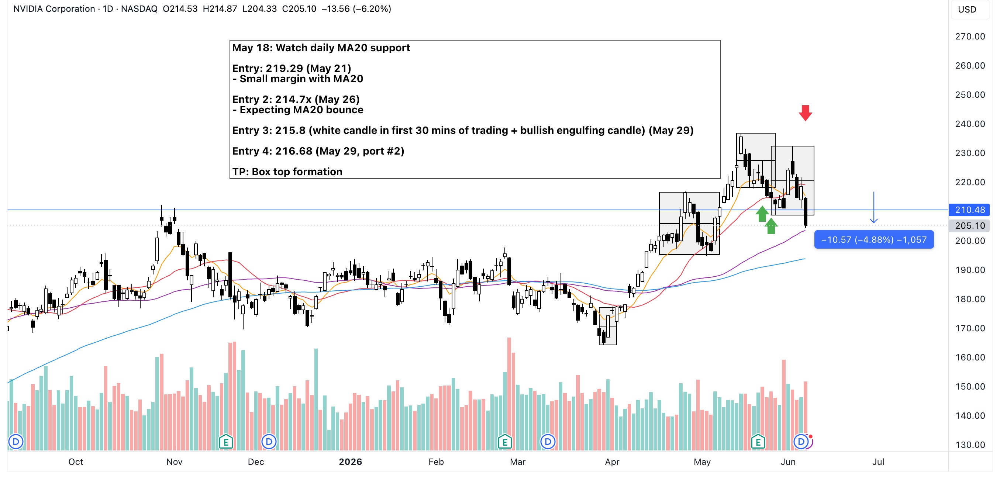

The idea was for the price to bounce from MA20. It did on June 1st but I didn't notice the bearish candle the following day. I guess my judgement was clouded by Nvidia's JH's keynote speech in Taiwan. Too much speculation lead to a miscalculation on my part.

I should have sold on the black reversal candle with a long wick.

## Trade Plan

May 18: Watch daily MA20 support

Entry: 219.29 (May 21)
- Small margin with MA20
- Small margin with major TSL

Entry 2: 214.7x (May 26)
- Expecting MA20 bounce

Entry 3: 215.8 (white candle in first 30 mins of trading + bullish engulfing candle) (May 29)

Entry 4: 216.68 (Go trade, 8.97 shares)

TP: Box top formation

## Notes:
May 29:
- 15 min candle broke MA100

June 1:
- Nvidia JH keynote speech in Taiwan looks like to be a catalyst. (Why is this here???)
- Day 0 of box top.
- ~6% price increase with good volume.

June 2-4:
- No notes

## Exit
June 5
- Sold EOD on long black candle.
- Also today was the one of the longest black candles of NASDAQ after a long time.

{==Mind the candles EVERYDAY! Watch out for reversals!==}