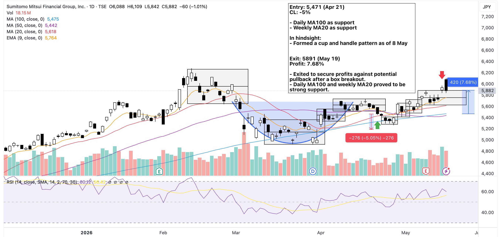
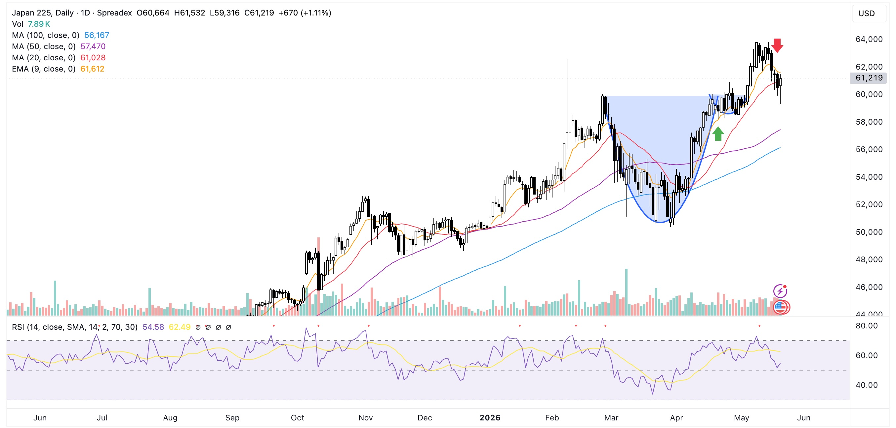

Finally was able to gain back what I lost on this pick from [almost 3 months back](https://trade.luislogs.com/2026/05/16/smfg-8316-a-loss-to-the-bears/).

Re-entry point mainly anchored on the daily MA100 and weekly MA20 of the stock expecting a cup and handle pattern. And it did-- the handle was supported by MA100 on the daily chart.

As for the exit, a pullback seemed more common than a follow through of the breakout candle. I exited based on this. Though this morning (day after the exit), the price jumped around 2.5%.

**Should I consider to sell the next morning after the breakout candle?**

Also in hindisght, the index formed the same pattern.

{==Don't forget to check the index once in a while==}
